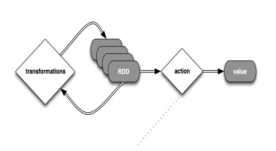

# Part two (1.5 - 2 hours)

# What is Spark?

[Spark, The Ultimate Scala Collections, by Martin Ordersky](https://www.slideshare.net/SparkSummit/spark-the-ultimate-scala-collections-by-martin-odersky)

- Spark is a `D`omain `S`pecific `L`anguage (`DSL`) on top of Scala for distributed data processing.
- Implemented in Scala
- Embeded in Scala as a host language


- Immutable data set and functional transformers.
- Support for 
  - Scala 
  - Java 
  - Python
  - R
  
### Why Spark makes heavy use of `type`s?

- Functional operations do not have hidden dependencies.
- Interactions are given in terms of `types`.
- Logic errors are (usually) translated into `types` errors.

# A Note on Scala Syntax

In *Scala* we can take some shortcuts to make our programs simpler. Syntactically, Scala has some interesting options. 

```
case class Dog(name: String, age: Int, parent: Dog)

val dogs: List[Dog] = ...
```

This is the *Java* way, which is valid in *Scala*

```
val puppies = dogs.filter(dog => dog.age < 2)
```
However, we could write it in a compressed expression. 

```
val puppies = dogs.filter(_.age < 2)
```

### Another Example

```
val puppiesAndDad = dogs.filter(dog => dog.age < 2).map(puppie => (puppie, puppie.parent))
```

```
val puppiesAndDad: List[(Dog, Dog)] = dogs.filter(_.age < 2).map((_, _.parent))  
```

### Omittion Args

Sometimes, we don't need to define args just to pass them to other functions.

```
def println[A](f: A => Unit): Unit = ...

println(5)
println(Dog(...))

...

val puppies: List[Dog] = ....

puppies.foreach(puppie => println(puppie)) 

puppies.foreach(println)
```

### *For* should NOT be used for iterating. We will go back to this later on.


---------------------------------------------------------

# Spark Context, Interacting with the Outside World

We normally get a *SparkContext* (`sc`) when we open the shell. The `sc` has methods to interact with the outside world.

```
val linesRDD = sc.textFile("/Users/anicolaspp/b.txt")
```
Running this `.textFile` operation does nothing, it just makes a transformation that will be exucuted later on. 

Let's do something with our *lines*.

```
linesRDD.count()
```

```
res0: Long = 131843   
```

## Creating `RDD`s

- RDD are created from any kind of sources (Text Files, HDFS, Raw Sockets, AWS S3, Azure Blob Storage, Cassandra, etc...)
- RDD are lazy when calling Transformations on them.
- RDD are represented by Spark as DAG (recomputation)


# Computational Model & Resilient Distributed Datasets (`RDD`s)

## Transformations are Lazy



### Some Transformations
- map
- mapPartitions
- flatMap
- filter
- take
- union
- intersaction
- distinct

### Some Actions
- reduce
- fold
- aggregate 
- collect
- count
- first
- takeSample
- saveAsTextFile


### Map

*map* is a functional transformater.

```
def map[A, B, M[_]](ma: M[A], f: A => B): M[B]
```
***Monads*** have `map` and in Scala collection are *Monads*.

`RDD`s are collections, so they have `map`!

```
val linesRDD = sc.textFile("/Users/anicolaspp/b.txt")

val lineLengthsRDD = linesRDD.map(line => line.length)

lineLengthsRDD.foreach(println)
```

### FlatMap

*flatMap* is another functional transformation, but a little more interesting

```
def flatMap[A, B, M[_]](ma: M[A], f: A => M[B]): M[B]
```

Let's get some use for it. 

We can use `flatMap` to extract *each* word from *line*

```
val wordsRDD = linesRDD.flatMap(_.split(" "))
```

```
res5: org.apache.spark.rdd.RDD[String] = MapPartitionsRDD[3] at flatMap at <console>:27
```

Again, nothing is executed. Let's run a *foreach* to print some of them out.

```
wordsRDD.take(20).foreach(pritnln)
```

### Filter

In the same way we used `map` and `flatMap`, we can use *filter*

```
def filter[A, M[_]](ma: M[A], f: A => Boolean): M[A]
```

Let's use it now.

```
val lordRDD = wordsRDD.filter(word => word == "Lord")

lordRDD.count()

res6: Long = 5000
```

### Reduce

*Reduce* will combine everything single pair on the *RDD* in order to generate a single, final value.

```
lordRDD.map(_.length).reduce(_ + _)
res8: Int = 20000
```
*The word Lord has 4 chars and there is 5000 of them => 20000*

*Reduce* cannot be used if the `RDD` is NOT *Empty*

```
val empty = sc.emptyRDD[Int]

empty.reduce(_+_)

java.lang.UnsupportedOperationException: empty collection
```

### Fold

*Fold* is the same as *Reduce*, with the same performance, but it uses a `Monoid[A]` so we can handle emptiness.

```
empty.fold(0)(_+_)
res10: Int = 0
```

*Fold* is defined as follows.

```
def fold[A](zero: A)(op: (A, A) => A): A 
```

### Collect

*Collect* is a very dangerous operation. It brings all the data to the master node. This could could cause the application to crash given that there might be not enough memory available in the master node for the entire dataset.

```
linesRDD.collect()

res11: Array[String] = Array("     __________________________________________________________________", "", "           Title: The King James Version of the Holy Bible", "      Creator(s): Anonymous", "          Rights: Public Domain", "   CCEL Subjects: All; Bible; Old Testament; New Testament; Apocrypha", "      LC Call no: BS185", "     LC Subjects:", "", "                  The Bible", "", "                  Modern texts and versions", "", "                  English", "     __________________________________________________________________", "", Holy Bible, "", "                               King James Version", "     __________________________________________________________________", "", "   TO THE MOST HIGH AND MIGHTY PRINCE JAMES, BY THE GRACE OF GOD,", "", "", "   KING OF GREAT...

```
**DO NOT perform *Collect* ever in production, it will bring your cluster down!!!**

### saveAsTextFile

*saveAsTextFile* will save your RDD to the file system. 

```
words.saveAsTextFile("/Users/anicolaspp/out_dir")
```

This operation will create a folder called *out_dir* and save the context of each partition on it. 
The folder is **immutable**. Spark knows that other operation saved data there so it will not allow you write on it again. 

The same happens with **saveAsObjectFile** but this time, the `RDD` is serialized and stored as an object. 

```
words.saveAsObjectFile("/Users/anicolaspp/out_dir.txt")
```

---------------------------------------------------------

# Working with *PairRDD*

Many tutorials (and people) talk about *PairRDD* as an special kind of *RDD*, but in *Scala* tuples are just a other type. 

Let's create a simple *PairRDD*

```
val pairs = sc.parallelize((1 to 1000).map(x => (x, x.toString.length)))

pairs.forach(println)
```

What about if we want all number with the same *length*?

```
def desiredLength(n: Int, pairs: RDD[(Int, Int)]): RDD[Int] = pairs.filter(_._2 == n).map(_._1)
```

and then we can use this function

```
val numberOfLength_3 = desiredLength(2, pairs)

numberOfLength_3.foreach(println)
```

Spark provides some functions to work specifically with *PairRDD*

Let's suppose now we want to know how many number of a specific length we got. 

```
desiredLength(2, pairs).reduce(_ + _)
```

another way could be 

```
def totalOfLength(n: Int, pairs: RDD[(Int, Int)]) = 
  pairs
    .map { case (number, length) => (length, number)}
    .reduceByKey(_ + _)
    .filter { case (length, _) => length == n }
    .map(_._2)
```

```
totalOfLength(2, pairs).foreach(println)

4905
```
We can easily validate this with pure *Scala*

``` 
(10 to 99).sum

4905
```

We can generalize *totalOfLength* !

```
trait Semigroup[A] {
  def app(x: A, y: A): A
}

implicit val intSemi = new Semigroup[Int] {
  def app(x: Int, y: Int) = x + y
}


implicit val strSemi = new Semigroup[String] {
  def app(x: String, y: String) = (x.length + y.length).toString
}

def totalOfLength[A](n: Int, pairs: RDD[(A, Int)])(implicit sg: SemiGroup[A]) = 
  pairs
    .map { case (v, length) => (length, v)}
    .reduceByKey(sg.app)
    .filter { case (length, _) => length == n }
    .map(_._2)
```

---------------------------------------------------------

# Word Count

```
val sorted = 
  linesRDD
    .flatMap(_.split(" "))
    .map(w => (w, 1))
    .reduceByKey(_ + _)
    .map {case (x, y) => (y, x)}
    .sortByKey(false)
```
Another option is *sortBy* which removes `.map {case (x, y) => (y, x)}`

```
val sorted = 
  linesRDD
    .flatMap(_.split(" "))
     .map(w => (w, 1))
     .reduceByKey(_ + _)
     .sortBy(_._2, false)
```
Things to remember: 

- *sortBy* has higher network traffic.
- Behind the scence, *sortBy* also do a *map* `(f(x), x)`.
- *sortByKey* partitioned RDD can be useful for downstream processing.
- don't use them for selecting the top elements, use *top*, *takeTop* instead.
