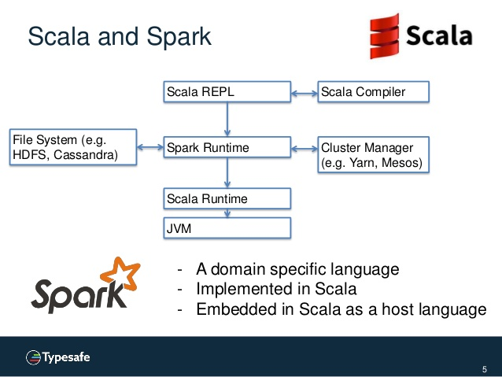

# Part two (1.5 - 2 hours)

# What is Spark?

[Spark, The Ultimate Scala Collections, by Martin Ordersky](https://www.slideshare.net/SparkSummit/spark-the-ultimate-scala-collections-by-martin-odersky)

- Spark is a `D`omain `S`pecific `L`anguage (`DSL`) on top of Scala for distributed data processing.
- Implemented in Scala
- Embeded in Scala as a host language

- Immutable data set and functional transformers.
- Support for 
  - Scala 
  - Java 
  - Python
  - R
  
### Why Spark makes heavy use of `type`s?

- Functional operations do not have hidden dependencies.
- Interactions are given in terms of `types`.
- Logic errors are (usually) translated into `types` errors.

# Computation Model & Resilient Distributed Datasets (`RDD`s)

